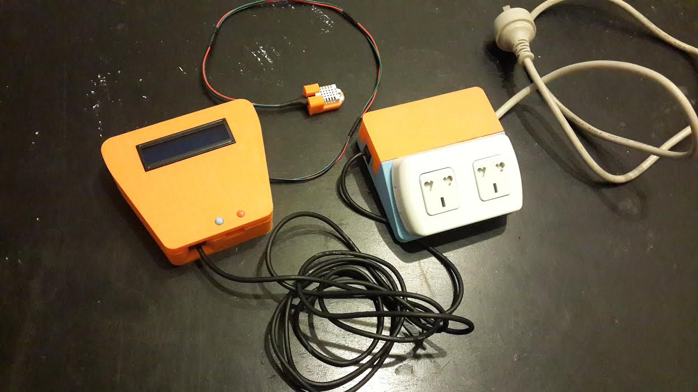

# IoT-NodeMCU

### Features
* Reads temperature and humidity
* Show current state in a 16x2 Display
* Allows to switch on/off 2 outlets from HTTP POST over wifi
* Expose an API at root when connected to Wifi returning a JSON with the current state
* Posting state to another webserver at a period of time
* Expose NodeMCU GPIOs for future plug-ins (like other sensors)
* Outside buttons for Reset and Flash without the need for opening the box

### What's in this repo?
* `arduino`: Arduino code for ESP8266 ESP-12F NodeMCU v2.0 (for uploading code follow [these instructions]() )
* `electronics`: Schema, components and modules list
* `box`: 3D design of the clousure and STL files for 3D Printing

