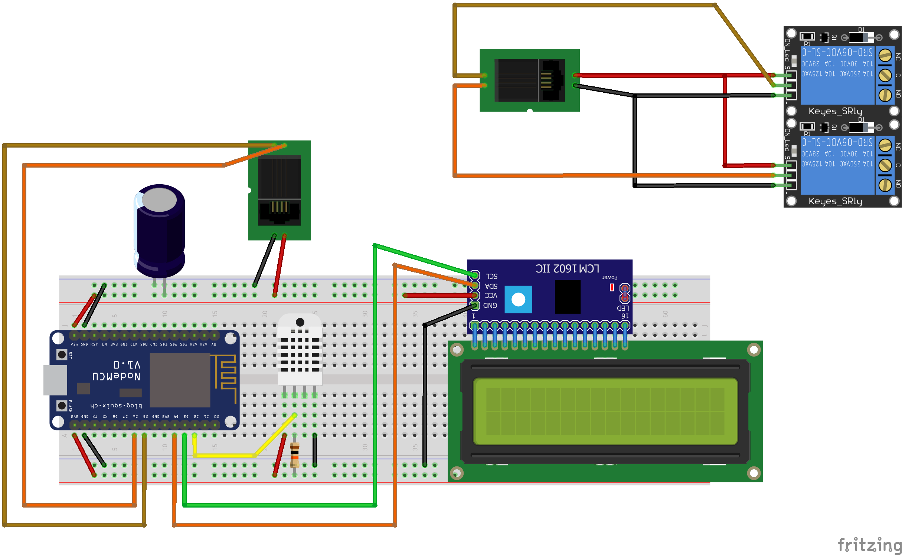

## Components
* Capacitor Polarized	3300uf 10v
* 10kΩ Resistor
* 2x RJ11 Female

## Modules
* ESP8266 WiFi ESP-12F - NodeMCU v2.0
* DHT22 Humidity and Temperature Sensor	
* I2C PCF8754
* Display Lcd 1602 HD44780 16x2
* 2 Relay Module - 5v to 220v 10A

